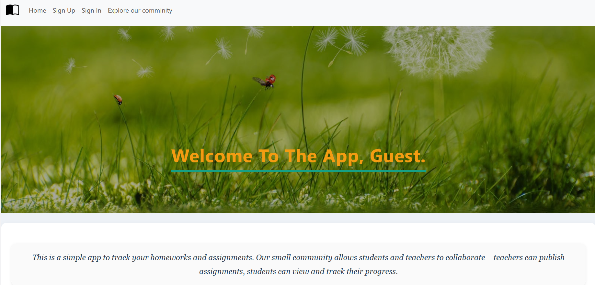
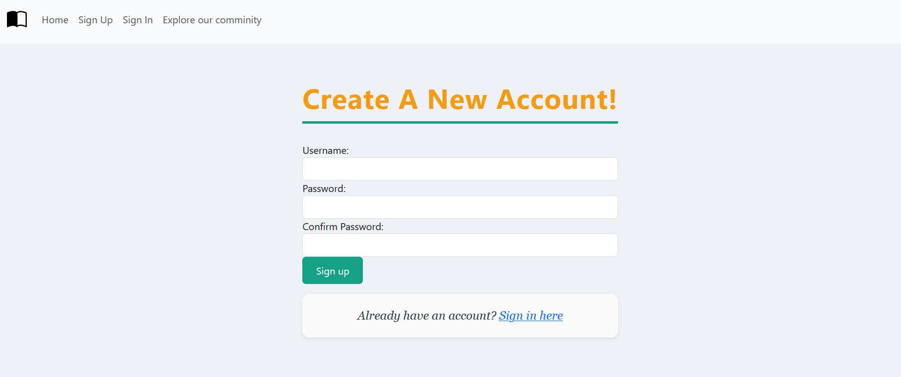
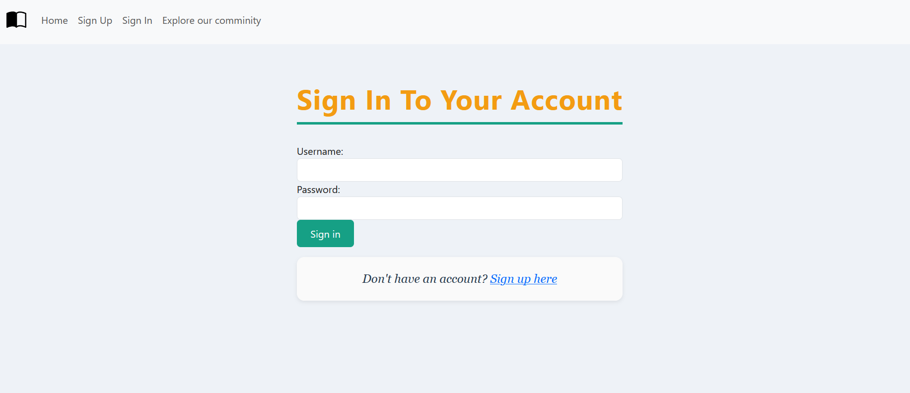
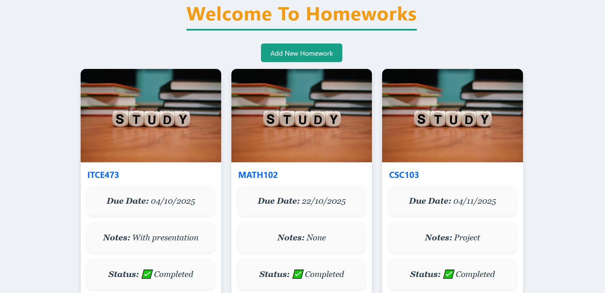
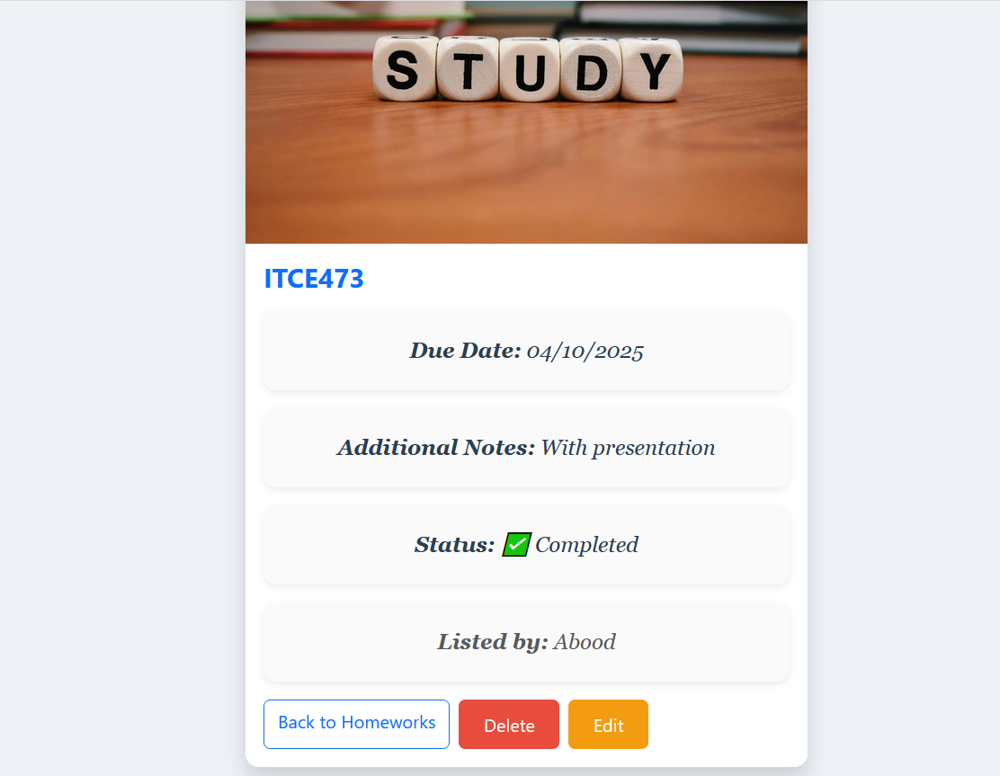
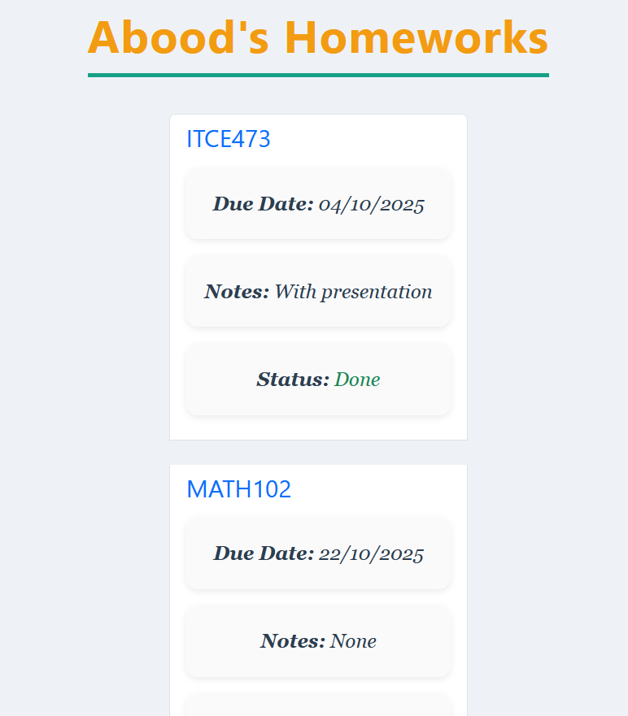

# Homework Tracker

assignments Tracker is a simple yet powerful tool that allows students to simply track their assignments.  It supports complete CRUD (Create, Read, Update, and Delete) capability and has a community site where users may view all contributed homework. Instructors and teachers can also share assignments with students without logging in.

---

## Features
- **Interactive Home Page** – Features a clean and user-friendly navigation bar.
- **Authentication System** – Sign-up and login pages with secure authentication.
- **Create Homework** – A well-designed page for adding new homework.
- **Manage Homework** – View assignments with an image, and edit or delete them.
- **Mark as Done** – A button to mark homework as completed.
- **Community Page** – Browse homework submitted by all users.

---

## Screenshots

### Home Page

### Sign-Up Page

### Sign-In Page

### All Homeworks Page

### Show Page

### Community Page

---

## Technologies Used

- **Node.js** – Server-side runtime environment.
- **Express.js** – Web framework for handling routes and middleware.
- **MongoDB** – Stores homework data efficiently.
- **Mongoose** – ODM library for MongoDB.
- **JavaScript** – Handles functionality and interactivity.
- **HTML & CSS** – Structures and styles the application.
- **EJS (Embedded JavaScript)** – Renders dynamic content.
- **Bootstrap** – Enhances the UI with responsive design.

---

## Project Planning
**User Stories:**
- As a user, I want to see a welcome page.
- As a user, I want to see a login nav button.
- As a user, I want to see an add new homework button.
- As a user, I want to easily add new homework.
- As a user, I want to be redirected to all homeworks page.
- As a user, I want to edit the homework easily.
- As a user, I want to delete the homework if I want.

---

## User (user.js)

| Field            | Type                | Description                       |
|------------------|---------------------|-----------------------------------|
| name             | String              | User's name                       |
| password         | String              | User's password                   |
| confirm password | String              | Confirmation of the password      |
| homeworks        | [homeworksSchema]   | List of homeworks for the user    |

---

## Homework (homeworks.js)

| Field            | Type     | Description                           |
|------------------|----------|---------------------------------------|
| subject          | String   | Subject of the homework                |
| due date         | Date     | Deadline of the homework               |
| additional notes | String   | Extra notes related to the homework    |
| mark as done     | Boolean  | Indicates if the homework is finished  |

---

## Relationship
- **One-to-Many**: A **User** can have multiple **Homeworks**.  

